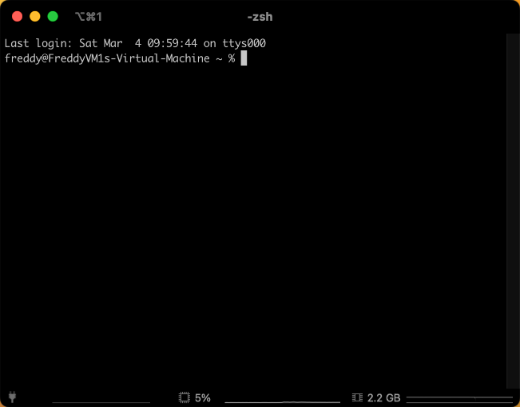

# Environment Setup

How to set up a new Mac for software development.

- [Environment Setup](#environment-setup)
  - [Version Control - Git](#version-control---git)
  - [Package Manager - Homebrew](#package-manager---homebrew)
  - [Terminal - iTerm2](#terminal---iterm2)
  - [Shell - Zsh](#shell---zsh)

Start by opening up the `terminal` application.

## Version Control - Git

This triggers `MacOS` to install the `Xcode Command Line Tools`, which includes `git`.

```bash
git --version
```

## Package Manager - Homebrew

Navigate to https://brew.sh and copy the code into your terminal to install `Homebrew` package manager.

```bash
/bin/bash -c "$(curl -fsSL https://raw.githubusercontent.com/Homebrew/install/HEAD/install.sh)"
```

Then add the `brew` command to your PATH:

```bash
(echo; echo 'eval "$(/opt/homebrew/bin/brew shellenv)"') >> /Users/freddy/.zprofile
eval "$(/opt/homebrew/bin/brew shellenv)"
```

## Terminal - iTerm2

iTerm2 is a replacement for the default `MacOS` terminal.
It has a lot of features that make the development experience better.

```bash
brew install --cask iterm2
```

Close the `terminal` application and open `iTerm` instead.
Any time I refer to the terminal in this guide, I mean the iTerm2 one.

With the `iTerm` application open, go to `Preferences` and select the `Appearance` tab.
Within the `General` tab, set `Theme` to `Minimal`, and `Status Bar` to `Bottom`.


In the `Profiles` tab, select the `Session` tab, and then check `Status bar enabled` at the bottom of the window and then click the `Configure Status Bar` button.


I like to have the `Battery Level`, `CPU Utilization`, `Memory Utilization`, `Network Throughput` in my status bar.



## Shell - Zsh

Zsh is a shell that is more powerful than the default `MacOS` bash shell.

```bash
brew install zsh
```
