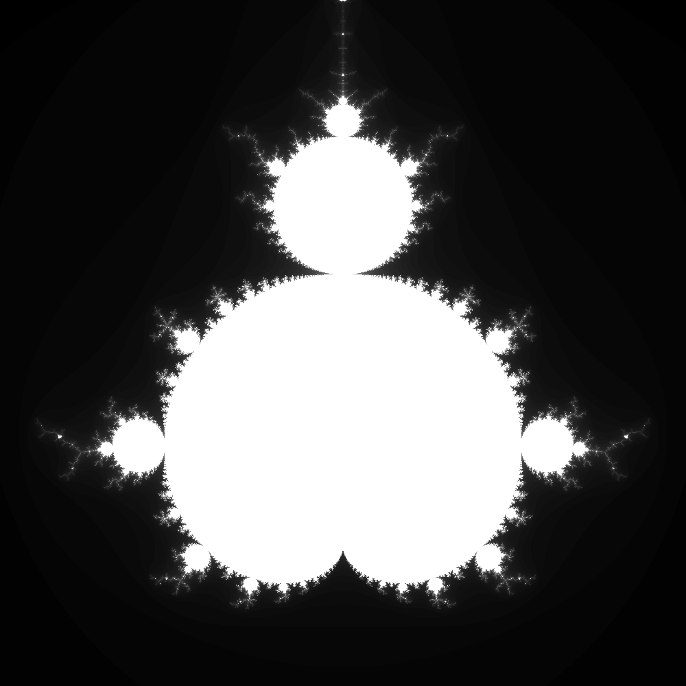

# Images

So far we have a function that can calculate the number of iterations for a given point.
We can use this to create an image by looping over an array of points, calculating the number of iterations for each point and then turing those iterations into a colour.

## 0 - Add numpy

We'll use `numpy` arrays to store the image data.

```bash
poetry add numpy
```

## 1 - Add sample.area()

Within the [`sample.py`](./mandy/sample.py) file we'll add the `numpy` import:

```python
import numpy as np
```

And then at the bottom, we'll add a function called `area()`:

```python
def area(real, imag, width, height, scale, max_iterations=100):
    re = np.linspace(real - 0.5 * scale * width, real + 0.5 * scale * width, width)
    im = np.linspace(imag - 0.5 * scale * height, imag + 0.5 * scale * height, height)

    mandelbrot_set = np.zeros((height, width))

    for i in range(height):
        for j in range(width):
            mandelbrot_set[i, j] = point(re[j], im[i], max_iterations)

    return mandelbrot_set
```

## 2 - Try it out

We can try out this function by running the following code in a `Python` REPL:

```bash
poetry run python -c "import mandy; print(mandy.sample.area(-0.5, 0, 17, 17, 0.2, 99))"
```

You should see an array of numbers printed looking like this:

```
[[ 0.  0.  0.  0.  0.  0.  1.  1.  1.  1.  1.  1.  1.  1.  1.  1.  0.]
 [ 0.  0.  0.  0.  0.  1.  1.  1.  1.  1.  1.  1.  1.  1.  1.  1.  1.]
 [ 0.  0.  0.  0.  1.  1.  1.  2.  2.  2.  1.  1.  1.  1.  1.  1.  1.]
 [ 0.  0.  0.  1.  2.  2.  2.  2.  3.  4.  5.  3.  2.  1.  1.  1.  1.]
 [ 0.  0.  1.  2.  2.  2.  2.  3.  4. 18. 19.  4.  3.  2.  1.  1.  1.]
 [ 0.  0.  2.  2.  2.  2.  3.  5. 19. 99. 99. 45. 14.  2.  2.  1.  1.]
 [ 0.  0.  2.  2.  4.  5.  5.  8. 99. 99. 99. 99. 42.  3.  2.  1.  1.]
 [ 0.  1.  3.  4.  6. 99. 99. 99. 99. 99. 99. 99. 99.  3.  2.  1.  1.]
 [ 0. 99. 99. 99. 99. 99. 99. 99. 99. 99. 99. 99.  7.  3.  2.  2.  1.]
 [ 0.  1.  3.  4.  6. 99. 99. 99. 99. 99. 99. 99. 99.  3.  2.  1.  1.]
 [ 0.  0.  2.  2.  4.  5.  5.  8. 99. 99. 99. 99. 42.  3.  2.  1.  1.]
 [ 0.  0.  2.  2.  2.  2.  3.  5. 19. 99. 99. 45. 14.  2.  2.  1.  1.]
 [ 0.  0.  1.  2.  2.  2.  2.  3.  4. 18. 19.  4.  3.  2.  1.  1.  1.]
 [ 0.  0.  0.  1.  2.  2.  2.  2.  3.  4.  5.  3.  2.  1.  1.  1.  1.]
 [ 0.  0.  0.  0.  1.  1.  1.  2.  2.  2.  1.  1.  1.  1.  1.  1.  1.]
 [ 0.  0.  0.  0.  0.  1.  1.  1.  1.  1.  1.  1.  1.  1.  1.  1.  1.]
 [ 0.  0.  0.  0.  0.  0.  1.  1.  1.  1.  1.  1.  1.  1.  1.  1.  0.]]
```

## 3 - Adding colour

We can create an image by converting each of these numbers into a colour.

Let's create a new file called [`colour.py`](./mandy/colour.py) next to `sample.py`:

```bash
touch mandy/colour.py
```

And then link it to the `__init__.py` file:

```python
from . import colour
```

## 4 - Grayscale "colouring"

Back inside `colour.py` we'll add a function called `grayscale()` which will convert an integer number into an RGB colour:

```python
def grayscale(value, max_iters):
    x = value / max_iters * 255
    return (x, x, x)
```

## 5 - Image data

We now have a method of generating an array of numbers, and a function to turn each of them into a colour.

We'll add a function named `image()` to the bottom of the `colour.py` file, which uses both of these to take an array of numbers and turn it into an image array:

```python
import numpy as np # We can add this to the top of the for neatness.

def image(data, max_iters, colouring):
    height, width = data.shape
    img = np.zeros((height, width, 3), dtype=np.uint8)

    for i in range(height):
        for j in range(width):
            img[i, j] = colouring(data[i, j], max_iters)

    return img
```

## 6 - Encoding a PNG image

Finally, we need a way to encode the image array into a PNG image.
We can do this using the `PIL` library:

```bash
poetry add pillow
```

And then we'll add a function called `encode()` to the bottom of the `colour.py` file:

```python
from PIL import Image # We can add this to the top of the for neatness.

def encode(data):
    return Image.fromarray(data)
```

## 7 - Putting it all together

We can now put all of these functions together to create an image of the Mandelbrot set.
We'll replace the [`run.py`](./scripts/run.py) file with the following code:

```python
import argparse
import mandy

parser = argparse.ArgumentParser()
parser.add_argument("real", type=float)
parser.add_argument("imag", type=float)
parser.add_argument("width", type=int)
parser.add_argument("height", type=int)
parser.add_argument("scale", type=float)
parser.add_argument("max_iters", type=int)
args = parser.parse_args()

data = mandy.sample.area(
    args.real, args.imag, args.width, args.height, args.scale, args.max_iters
)
cols = mandy.colour.image(data, args.max_iters, mandy.colour.grayscale)
img = mandy.colour.encode(cols)
img.save("mandy.png")
```

## 8 - Try it out

We can now run the script to create an image of the Mandelbrot set:

```bash
poetry run python scripts/run.py -0.5 0 1000 500 0.0025 100
```

You should see a file called `mandy.png` in the root of the project.
If you open it you should see something like this:


