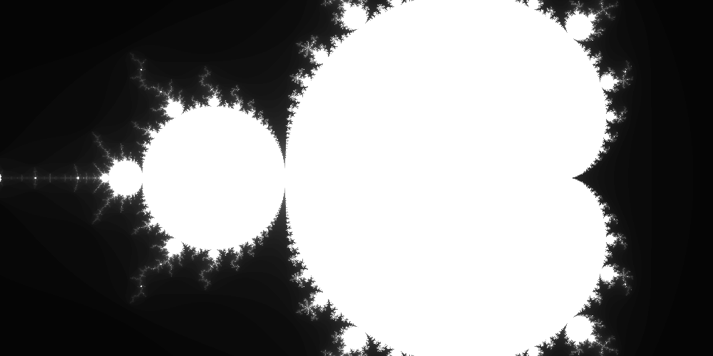

# Images

So far we have a function that can calculate the number of iterations for a given point.
We can use this to create an image by looping over an array of points, calculating the number of iterations for each point and then turing those iterations into a colour.

## 0 - Numbers to RGB

We can create an image by converting each of these numbers into a colour encoded by a tuple of three numbers representing the red, green and blue components.
Each of these components can be any number between 0 and 255, and we can use these numbers to create a wide range of colours.

Let's create a new file called [`colour.py`](./mandy/colour.py) next to `sample.py`:

```bash
touch mandy/colour.py
```

And then link it to the library by adding an import to the [`__init__.py`](./mandy/__init__.py) file:

```python
from . import colour
```

## 1 - Grayscale "colouring"

Back inside [`colour.py`](./mandy/colour.py) we'll add a function called `grayscale()` which will convert an integer number into an RGB colour:

```python
def grayscale(value, max_iters):
    x = value / max_iters * 255
    return (x, x, x)
```

(Yeah, I know, it's not really a colour, but it's a good starting point - and we'll add more colouring functions later.)

## 2 - Image data

We now have a method of generating an array of numbers, and a function to turn each of them into an RGB colour.

Next let's add a function named `image()` to the bottom of the `colour.py` file, which takes an array of numbers and a colouring function and returns an array of RGB colours:

```python
import numpy as np # We can add this to the top of the for neatness.

def image(data, max_iters, colouring):
    height, width = data.shape
    img = np.zeros((height, width, 3), dtype=np.uint8)

    for i in range(height):
        for j in range(width):
            img[i, j] = colouring(data[i, j], max_iters)

    return img
```

## 3 - Encoding a PNG image

Finally, we need a way to store the image array into a PNG image.
We can do this using the `PIL` (Python Imaging Library) library:

```bash
poetry add pillow
```

And then we'll add a function called `encode()` to the bottom of the `colour.py` file:

```python
from PIL import Image # We can add this to the top of the for neatness.

def encode(data):
    return Image.fromarray(data)
```

## 4 - Putting it all together

We can now put all of these functions together to create an image of the Mandelbrot set.
We'll replace the [`run.py`](./scripts/run.py) file with the following code:

```python
import argparse
import mandy

parser = argparse.ArgumentParser()
parser.add_argument("real", type=float)
parser.add_argument("imag", type=float)
parser.add_argument("width", type=int)
parser.add_argument("height", type=int)
parser.add_argument("scale", type=float)
parser.add_argument("max_iters", type=int)
args = parser.parse_args()

data = mandy.sample.area(
    args.real, args.imag, args.width, args.height, args.scale, args.max_iters
)
cols = mandy.colour.image(data, args.max_iters, mandy.colour.grayscale)
img = mandy.colour.encode(cols)
img.save("mandy.png")
```

## 5 - Try it out

We can now run the script to create an image of the Mandelbrot set:

```bash
poetry run python scripts/run.py -0.5 0 1000 500 0.0025 100
```

You should see a file called `mandy.png` in the root of the project.
If you open it you should see something like this:


